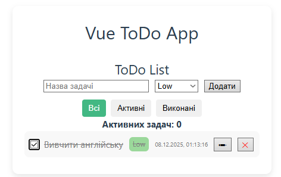
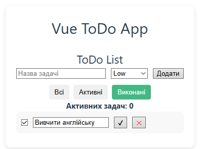

# Лабораторна робота №1  
## Vue.js 3 — Composition API

**Студент:** Кравчук Максим  
**Група:** ВТ-22-1  

---

## Кроки запуску проєкту

1. Встановити залежності:
```bash
npm install
```

2. Запустити проєкт:
```bash
npm run dev
```

3. Відкрити у браузері:
```
http://localhost:5173/
```

---

## Скріншоти






---

## Застосування Composition API

### ref / reactive

**ref використовується для:**
- зберігання нового тексту задачі;
- стану фільтра (all / active / done).

**reactive використовується для:**
- зберігання масиву задач (список ToDo).

---

### computed

**computed використовується для:**
- підрахунку кількості активних задач;
- фільтрації списку задач залежно від вибраного фільтра.

Кількість активних задач обчислюється автоматично при зміні списку.

---

### watch

**watch використовується для:**
- відстеження змін у списку задач;
- збереження задач у localStorage при кожній зміні.

---

## Використані директиви Vue

- `v-model` — для двостороннього зв’язування інпутів;
- `v-for` — для виводу списку задач;
- `v-if / v-else` — для умовного рендерингу;
- `:class` — для зміни стилів залежно від стану задачі;
- `@click` — для обробки подій.

---

## DevTools (Vue DevTools)

- список задач зберігається у state компонента;
- кількість активних задач обчислюється через computed;
- збереження даних у localStorage відбувається через watch.

У Vue DevTools можна переглянути:
- поточний стан списку;
- значення computed-властивостей;
- реактивні зміни даних.

---

## Висновок

У лабораторній роботі було реалізовано ToDo-застосунок із використанням Vue.js 3 та Composition API.  
Було застосовано ref, reactive, computed, watch, базові директиви Vue та Vue DevTools.  
Робота повністю відповідає вимогам лабораторного завдання.
