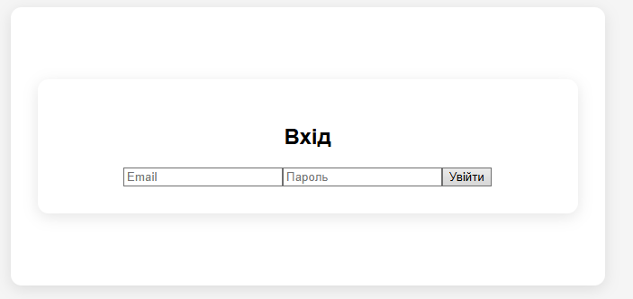
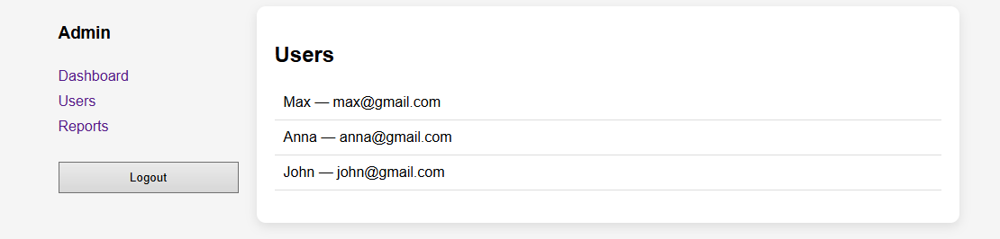
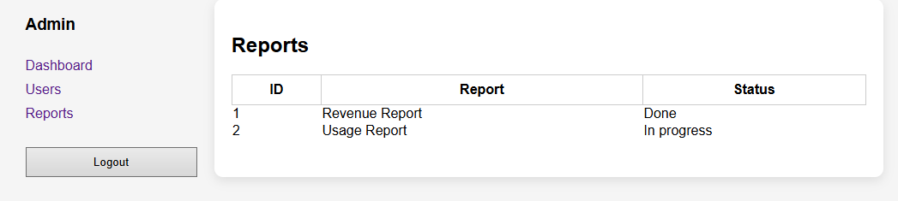

# Лабораторна робота №2
## Взаємодія між компонентами та роутинг у Vue.js

**Студент:** Кравчук Максим
**Група:** ВТ-22-1

## Кроки запуску

1. Встановити залежності:

npm install

2. Запустити застосунок у режимі розробки:

npm run dev

3. Відкрити у браузері:
http://localhost:5173/

# Скріншоти роботи програми

## Головна сторінка

Сторінка Login
Dashboard з вкладками (Overview / Activity)
Сторінка Users
Детальна сторінка користувача /admin/user/:id
Сторінка Reports (slots)
Not Found Page

## Використання props / emits
props:
передача даних користувачів у дочірні компоненти списку Users;

emits:
передача подій (наприклад, вибір користувача або дія над ним) з дочірнього компонента до батьківського.

Забезпечено однонапрямлений потік даних відповідно до концепції Vue.

## Використання v-model / defineModel

v-model використано в компонентах форм:
Login (email, password);
Register (дані нового користувача).

Двостороннє зв’язування спрощує обробку форм та оновлення стану.

## Використання provide / inject

provide використано для передачі інформації про авторизованого користувача.

inject використано в дочірніх компонентах Dashboard, Users, Reports.

Дозволяє уникнути «props drilling».

## Використання слотів (slots)

Застосовано scoped slots у компоненті Reports.

Дає можливість гнучко змінювати відображення даних у батьківському компоненті.

## Використання KeepAlive

Компоненти вкладок Dashboard (Overview, Activity) обгорнуті в <KeepAlive>.

Стан вкладок зберігається при перемиканні.

Дані не перевантажуються повторно.

# Роутинг
## Default та Named Router View

Використано стандартний <router-view>.

Layout дозволяє відображати вкладені маршрути.

## Lazy-loading маршрутів

Компоненти сторінок підвантажуються динамічно через import():

зменшення початкового бандлу;

оптимізація продуктивності.

## Route Guards

Navigation guard перевіряє авторизацію користувача.

Захищені маршрути:

/admin

/admin/*

У разі відсутності авторизації — редирект на /login.

## Збереження стану

Дані авторизації та користувачів зберігаються у localStorage.

Стан відновлюється після перезавантаження сторінки.

## Висновок

У лабораторній роботі реалізовано SPA-застосунок із маршрутизацією, автентифікацією та взаємодією між компонентами.
Практично застосовано props, emits, v-model, provide/inject, слоти, KeepAlive, lazy-loading маршрутів і route guards.
Отримано практичні навички побудови складних SPA у Vue.js 3.
