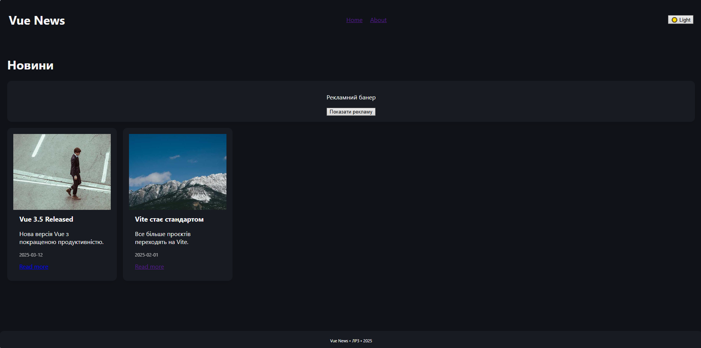
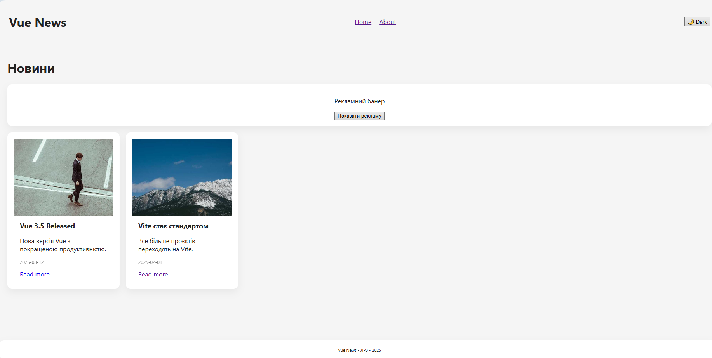
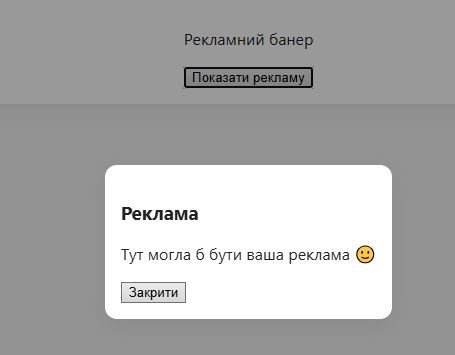
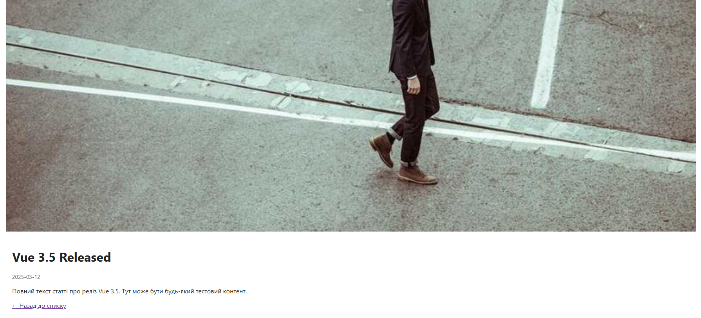

# Лабораторна робота №3  
## Тема: Стилізація компонентів у Vue.js

### Студент: Кравчук Максим  
### Група: ВТ-22-1  
### Рік: 2025

---

## 1. Мета та результат роботи

**Мета:**  
Ознайомитись з основними підходами до стилізації у Vue.js, зокрема:
- scoped-стилями;
- CSS Modules;
- динамічними класами та inline-стилями;
- використанням `<Transition>` для анімацій;
- застосуванням `<Teleport>` для модальних вікон.

**Результат:**  
Реалізовано міні-SPA **Vue News**, що містить кілька сторінок, перемикач тем, анімації переходів, модальне вікно та різні підходи до стилізації компонентів.

---

## 2. Використані технології

- Vue.js 3 (Composition API)
- Vue Router 4
- Vite
- Scoped CSS
- CSS Modules
- `<Transition>` та `<Teleport>`
- LocalStorage API

---

## 3. Інструкція запуску проєкту

1. Клонувати репозиторій та перейти у папку проєкту:
   ```bash
   git clone <repo-url>
   cd lab3
2. Встановити залежності:
npm install
3. Запустити застосунок у режимі розробки:
npm run dev
4. Відкрити у браузері:
http://localhost:5173/

---

## 4. Маршрути застосунку
/ — головна сторінка зі списком новин
/article/:id — детальна сторінка новини
/about — інформація про сайт
/:pathMatch(.*)* — сторінка 404 (Not Found)

# 5. Скріншоти










# 6. Особливості стилізації у Vue.js
## 6.1 Scoped CSS
Використовується у більшості компонентів для ізоляції стилів.
Стилі не впливають на інші компоненти.

## 6.2 CSS Modules
Застосовані для окремих UI-елементів (наприклад, карток новин).
Дозволяють уникнути конфліктів імен класів.

## 6.3 Динамічні класи та стилі
Використані для перемикання світлої / темної теми.
Класи змінюються залежно від стану компонента.

## 6.4 Transition
<Transition> застосовано для плавних анімацій переходів між сторінками.
Покращує користувацький досвід.

## 6.5 Teleport
<Teleport> використано для відображення рекламного модального вікна.
Модалка рендериться поза основною DOM-ієрархією.

---

# 7. Робота з Git
- Робота виконувалась у гілці lab3
- Після завершення виконано merge у main
- Коміти оформлені у стилі Conventional Commits, наприклад:
- feat: add theme switcher
- style: add scoped and module styles
- refactor: improve modal layout
- fix: correct transition animation

# 8. Висновки
Під час виконання лабораторної роботи було досліджено різні підходи до стилізації компонентів у Vue.js.
Отримано практичні навички використання scoped-стилів, CSS Modules, динамічних класів, анімацій переходів та Teleport.
Vue.js надає гнучкі та зручні інструменти для організації стилів у SPA-застосунках.
