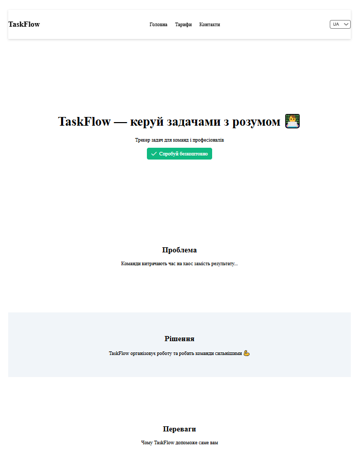
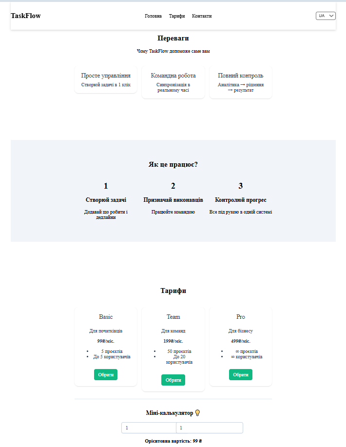
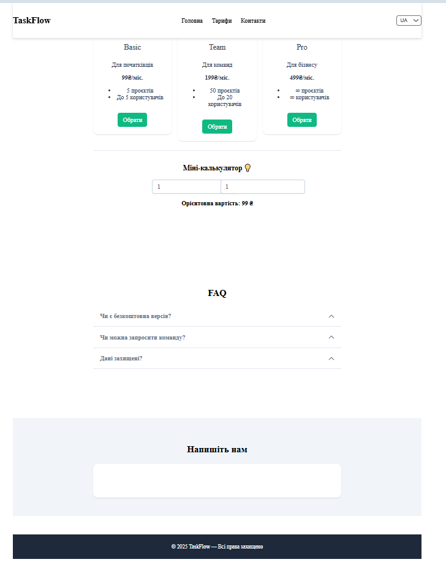

# Лабораторна робота №5  
## Тема: Використання інтерфейсних бібліотек (PrimeVue) та власних плагінів у Vue.js

### Студент: Кравчук Максим  
### Група: ВТ-22-1  
### Рік: 2025

---

## 1. Мета та результат роботи

**Мета:**  
Ознайомитися з використанням UI-бібліотеки **PrimeVue** у Vue 3, навчитися налаштовувати бібліотеку тем, застосовувати готові UI-компоненти, а також створювати та підключати **власний Vue-плагін**.

**Результат:**  
Реалізовано односторінковий лендінг SaaS-продукту з повною структурою секцій, використанням компонентів PrimeVue та власного плагіна CopyToClipboardPlugin.

---

## 2. Інструкція запуску проєкту

1. Встановити залежності:
   ```bash
   npm install
2. Запустити проєкт у режимі розробки:
npm run dev
3. Відкрити у браузері:
http://localhost:5173/

---

# 3. Структура лендінгу
У застосунку реалізовано повноцінний лендінг SaaS-продукту з такими секціями:

1. Header
- Навігація по секціях
- Перемикач мови (UA / EN)

2. Hero
- Назва продукту
- Короткий опис
- Кнопка заклику до дії

3. Проблема – Рішення
- Опис проблем користувачів
- Рішення, яке пропонує продукт

4. Переваги
- Основні переваги сервісу
- Картки з іконками та текстом

5. Як це працює
- Покроковий опис роботи сервісу

6. Тарифи / Плани
- Мінімум 3 тарифні плани
- Кожен план реалізований у вигляді Card
- Кнопка “Обрати план”

7. Відгуки
- Відгуки користувачів
- Картки з текстом та іменами

8. FAQ
- Часті запитання
- Розкривні елементи

9. Контактна форма
- Поля: імʼя, email, повідомлення
- Кнопка надсилання

10. Footer
- Копірайт
- Додаткова інформація

---

# 4. Використані компоненти PrimeVue
## У проєкті використано такі компоненти PrimeVue:
Button
Використовується у:
- Hero (CTA-кнопка)
- Тарифах
- Контактній формі
- Products page
Card
Використовується у:
- Секції “Переваги”
- Секції “Тарифи / Плани”
- Відгуках
InputText
Використовується у:
- Контактній формі
- Формі додавання даних
Textarea
Використовується у:
- Контактній формі
Toast
Використовується для:
- Повідомлень при копіюванні тексту
- Повідомлень про успішні дії

---

# 5. Налаштування PrimeVue
## PrimeVue підключено глобально у файлі main.ts:
Використано:
- PrimeVue з кастомним theme preset
- Тема Aura
Підключено:
- primeicons
- ToastService
PrimeVue використовується як основна UI-бібліотека для побудови інтерфейсу.

---

# 6. Плагін CopyToClipboardPlugin
## 6.1 Підключення плагіна
Плагін підключено глобально у main.ts через:
app.use(CopyToClipboardPlugin)

## 6.2 Призначення плагіна
- Плагін дозволяє копіювати текст у буфер обміну та показувати Toast-повідомлення про успішне копіювання.

## 6.3 Де використовується
Плагін викликається у:
- Секції тарифів (копіювання назви тарифу)
- Products page (копіювання назви товару)

## 6.4 Які значення копіюються
- Назва тарифного плану
- Назва товару
При успішному копіюванні відображається Toast-повідомлення:
- “Скопійовано в буфер обміну”

---

# 7. Git та організація розробки
Робота виконувалась у гілці lab5
Після завершення виконано merge у main
Коміти оформлено у стилі Conventional Commits, наприклад:
- feat: add pricing section
- feat: add CopyToClipboard plugin
- chore: configure PrimeVue
- refactor: improve landing layout

---

# Скріншоти







---

# 8. Висновки
У ході виконання лабораторної роботи №5 було реалізовано повноцінний лендінг із використанням PrimeVue, налаштовано UI-компоненти, створено та підключено власний плагін, а також застосовано сучасний підхід до структурування SPA у Vue.js. Отримано практичні навички інтеграції UI-бібліотек і написання власних Vue-плагінів.
